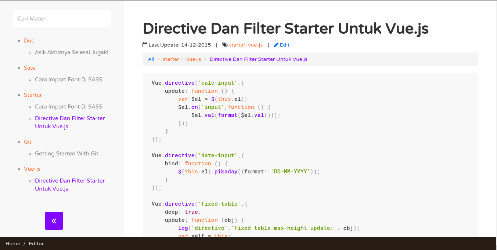

# micro-blogging-vue
Micro Blogging System Built with Vue.js.

Sebenernya Lebih deket ke aplikasi notes sih daripada micro blogging itu sendiri. But web app ini dibuat semata - mata untuk memudahkan saya yang tidak bisa menghafal semua API dari plugin - plugin yang saya pakai saat developing agar supaya mudah diakses walaupun tanpa akses internet.

## Penggunaan
Ya tinggal download, letakkan di localhost atau langsung buka index.html. gampang kok.

## Motivasi
Sering kali saya lupa penggunaan suatu perintah atau suatu API dari plugin dan sering kali pula saya membuka kode - kode lama yang pernah saya buat hanya untuk mengingat bagaimana penggunaan suatu plugin ataupun suatu perintah. Oleh karena itu untuk memudahkan saya mengingat terciptalah web app (notes) ini.

Ya emang masih banyak aplikasi yang lebih baik seperti
- gitbook
- devdocs
- dll.

Tapi selain alasan di atas, saya juga ingin improve skill saya dalam menggunaan Vue.js. terimakasih.

## Pengembangan
Untuk melakukan pengembangan project ini silahkan oprek folder 'vue' disana hanya ada beberapa komponen simple tapi tidak well commented. Mohon bantu benerin bug - bug yang masih berkeliaran.
